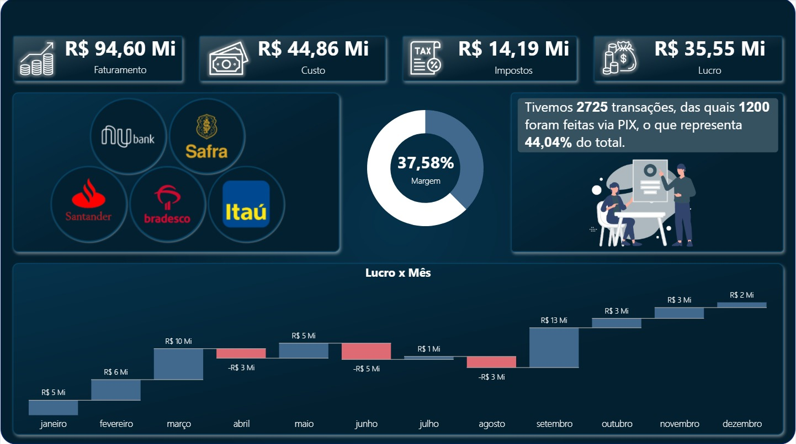

📊 Dashboard Financeiro — Power BI

Este projeto consiste em um dashboard financeiro desenvolvido no Power BI, utilizando como fonte de dados arquivos Excel.

O dashboard tem como objetivo fornecer uma visão estratégica da saúde financeira, permitindo analisar faturamento, custos, impostos, lucro, margem, meios de pagamento e evolução dos resultados ao longo do ano.

🖥️ Preview do Dashboard

🎯 Objetivos do Projeto

Analisar o desempenho financeiro da empresa

Monitorar indicadores-chave (KPIs) financeiros

Avaliar a rentabilidade e a margem do negócio

Analisar volume de transações e meios de pagamento

Praticar modelagem e visualização de dados no Power BI

Aplicar boas práticas de análise financeira

📌 Principais Indicadores (KPIs)

O dashboard apresenta os seguintes indicadores:

💰 Faturamento total
💸 Custo total
🧾 Impostos totais
📈 Lucro total
📊 Margem de lucro (%)
🔁 Quantidade de transações
💳 Participação de transações via PIX (%)

📊 Análises Disponíveis
📅 Temporal

Lucro por mês

Evolução dos resultados financeiros ao longo do ano

🏦 Instituições Financeiras

Distribuição das transações por banco

Comparativo entre instituições financeiras

💳 Meios de Pagamento

Quantidade de transações via PIX

Participação percentual do PIX no total de transações

📈 Rentabilidade

Análise da margem de lucro

Comparação entre faturamento, custos e impostos

🗄️ Fonte de Dados

Base utilizada:

📄 Arquivos Excel

Os dados financeiros foram organizados em planilhas e importados diretamente para o Power BI.

🧹 Tratamento de Dados

O tratamento dos dados foi realizado no Power Query, com foco em:

Limpeza e padronização dos dados

Ajuste de tipos de dados

Criação de colunas auxiliares

Organização do modelo para análise financeira

Preparação para criação de medidas em DAX

🧩 Modelagem de Dados

Estrutura organizada para análise financeira

Separação entre dados de transações, valores financeiros e dimensões auxiliares

Criação de medidas para KPIs e análises temporais

🛠️ Tecnologias Utilizadas

Power BI Desktop

Excel

Power Query

DAX (Data Analysis Expressions)

Modelagem de dados

🧠 Conceitos Aplicados

ETL com Power Query

Modelagem de dados

Criação de medidas e KPIs em DAX

Análise financeira

Visualização de dados

Storytelling com dados

▶️ Como Visualizar
Opção 1 — Visualizar imagem

Abra o arquivo:

assets/dashboard-financeiro.png
Opção 2 — Abrir no Power BI

Abra o arquivo:

Dashboard-Financeiro.pbix

Utilizando o Power BI Desktop.