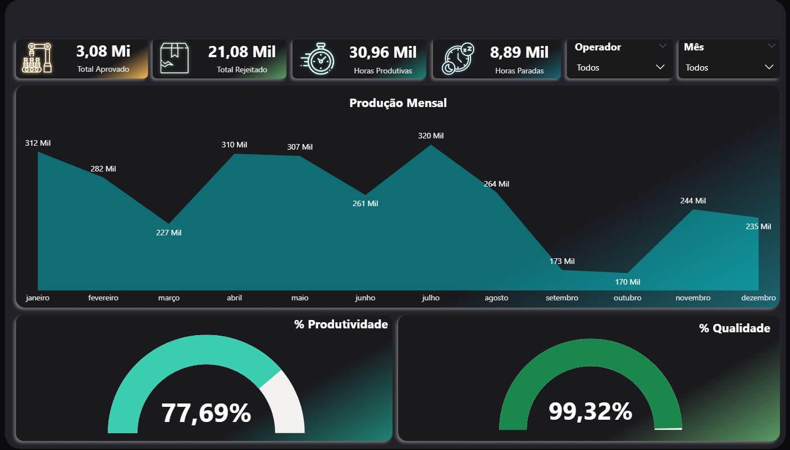

🏭 Dashboard de Produção — Power BI

Este projeto consiste em um dashboard de produção desenvolvido no Power BI, utilizando como fonte de dados arquivos Excel.

O dashboard tem como objetivo fornecer uma visão clara e estratégica do desempenho produtivo, permitindo analisar volume produzido, produtividade, qualidade, horas produtivas, horas paradas e rejeições ao longo do tempo.

🖥️ Preview do Dashboard

🎯 Objetivos do Projeto

Monitorar o desempenho da produção

Avaliar produtividade e eficiência operacional

Analisar qualidade do processo produtivo

Identificar gargalos e períodos de baixa produção

Acompanhar horas produtivas e horas paradas

Praticar modelagem e visualização de dados no Power BI

📌 Principais Indicadores (KPIs)

O dashboard apresenta os seguintes indicadores:

✅ Total Aprovado
❌ Total Rejeitado
⏱️ Horas Produtivas
🛑 Horas Paradas
📊 Produtividade (%)
🎯 Qualidade (%)

📊 Análises Disponíveis
📅 Produção Mensal

Volume de produção por mês

Comparação do desempenho produtivo ao longo do ano

⚙️ Produtividade

Percentual de produtividade geral

Relação entre horas produtivas e horas paradas

🧪 Qualidade

Percentual de qualidade do processo

Comparação entre itens aprovados e rejeitados

👷 Operação

Análise por operador

Filtros dinâmicos por operador e mês

🗄️ Fonte de Dados

Base utilizada:

📄 Arquivos Excel

Os dados de produção foram organizados em planilhas e importados diretamente para o Power BI.

🧹 Tratamento de Dados

O tratamento dos dados foi realizado no Power Query, com foco em:

Limpeza e padronização dos dados

Correção de tipos de dados

Criação de colunas auxiliares

Organização do modelo para análise produtiva

Preparação dos dados para criação de medidas em DAX

🧩 Modelagem de Dados

Estrutura organizada para análise de produção

Separação entre dados de produção, tempo e operadores

Criação de medidas para indicadores de produtividade e qualidade

🛠️ Tecnologias Utilizadas

Power BI Desktop

Excel

Power Query

DAX (Data Analysis Expressions)

Modelagem de dados

🧠 Conceitos Aplicados

ETL com Power Query

Modelagem de dados

Criação de KPIs em DAX

Análise de produtividade

Análise de qualidade

Visualização de dados

Storytelling com dados

▶️ Como Visualizar
Opção 1 — Visualizar imagem

Abra o arquivo:

assets/dashboard-producao.png
Opção 2 — Abrir no Power BI

Abra o arquivo:

Dashboard-Producao.pbix

Utilizando o Power BI Desktop.