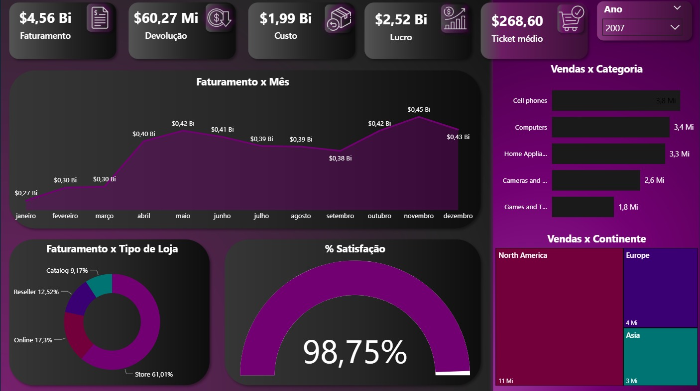

📊 Dashboard de Vendas — Power BI (Contoso Retail)

Este projeto consiste em um dashboard de vendas desenvolvido no Power BI, utilizando como fonte de dados o banco Contoso Retail, disponibilizado pela Microsoft.

O objetivo do dashboard é fornecer uma visão estratégica das vendas, permitindo análise de faturamento, lucro, custos, categorias, regiões e desempenho ao longo do tempo.

🖥️ Preview do Dashboard

🎯 Objetivos do Projeto

Analisar o desempenho de vendas

Monitorar indicadores-chave (KPIs)

Identificar tendências e padrões

Praticar integração entre SQL e Power BI

Aplicar boas práticas de modelagem de dados

📌 Principais Indicadores (KPIs)

O dashboard apresenta os seguintes indicadores:

💰 Faturamento total

📉 Total de devoluções

💸 Custo total

📈 Lucro total

🧾 Ticket médio

😊 Percentual de satisfação

📊 Análises disponíveis
Temporal

Faturamento por mês

Evolução das vendas ao longo do ano

Geográfica

Vendas por continente

Produto

Vendas por categoria

Desempenho por tipo de produto

Loja

Faturamento por tipo de loja:

Store

Online

Reseller

Catalog

🗄️ Fonte de Dados

Base utilizada:

Contoso Retail Database (Microsoft)

A base foi armazenada em banco de dados relacional e conectada diretamente ao Power BI.

🧹 Tratamento de Dados

Os dados foram tratados utilizando SQL, com foco em:

Seleção apenas das colunas necessárias

Otimização do modelo de dados

Redução de volume desnecessário

Melhoria de performance no Power BI

Tabelas tratadas:

DimStore

DimProduct

🔗 Integração com Banco de Dados

O Power BI está conectado diretamente ao banco de dados, permitindo:

Atualização dinâmica dos dados

Melhor performance

Arquitetura mais próxima de um ambiente real

🛠️ Tecnologias utilizadas

Power BI Desktop

SQL

Banco de dados relacional

Modelagem de dados

DAX (Data Analysis Expressions)

🧠 Conceitos aplicados

ETL básico com SQL

Modelagem dimensional

Criação de medidas em DAX

Desenvolvimento de dashboards interativos

Visualização de dados

Análise exploratória de dados

▶️ Como visualizar
Opção 1 — Visualizar imagem

Abra o arquivo:

assets/dashboard-vendas.png
Opção 2 — Abrir no Power BI

Abra o arquivo:

Dashboard-Vendas.pbix

Utilizando o Power BI Desktop.